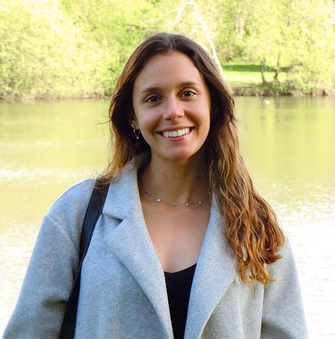

&nbsp;&nbsp;&nbsp;&nbsp;Hello and welcome to my webpage! I'm Inês, a Data Science and Machine Learning student from Lisbon, Portugal. 
&nbsp;&nbsp;&nbsp;&nbsp;I'm interested in optimization, computer vision, NLP, and causality, and I love learning and sharing my knowledge with the community. 
&nbsp;&nbsp;&nbsp;&nbsp;I'm involved in research projects and personal projects, and I'm excited to contribute to the ML community. Through this blog, I hope to share my experiences and insights with you and contribute to the machine learning community. I'll be writing about interesting topics within the field and providing valuable insights into the latest trends and techniques. 
{: style="text-align: justify"}

&nbsp;&nbsp;&nbsp;&nbsp;Thank you for joining! Hope you enjoy :wink:
{: style="text-align: justify"}